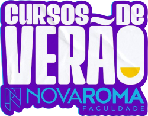

# Hackeando Dados da Web (Eticamente!)
Um Minicurso de Web Scraping e Automação Web

Este repositório contém os materiais do minicurso "Hackeando Dados da Web (Eticamente!): Um Minicurso de Web Scraping e Automação Web", ministrado no curso de verão da Faculdade Nova Roma. Aqui você encontrará a apresentação, o código em Jupyter Notebook, e instruções para configurar e executar o ambiente.

## **Objetivo do Minicurso**
Capacitar os participantes a automatizar interações com páginas da web e realizar web scraping de forma eficiente, utilizando Python e a biblioteca Selenium.

## **Conteúdo do Repositório**

-   **`minicurso Selenium.pdf`**: Slides utilizados durante o minicurso.
-   **`webScrapping.ipynb`**: Código interativo com exemplos e exercícios práticos.

## **Tópicos Abordados**

1.  **Introdução à Automação Web e Web Scraping.**
2.  **Identificação de Elementos (XPath, Seletores CSS).**
3.  **Automatizando Login e Navegação em Sites.**
4.  **Coleta de Dados e Exportação para CSV.**
5.  **Projeto Prático Integrado.**

----------
